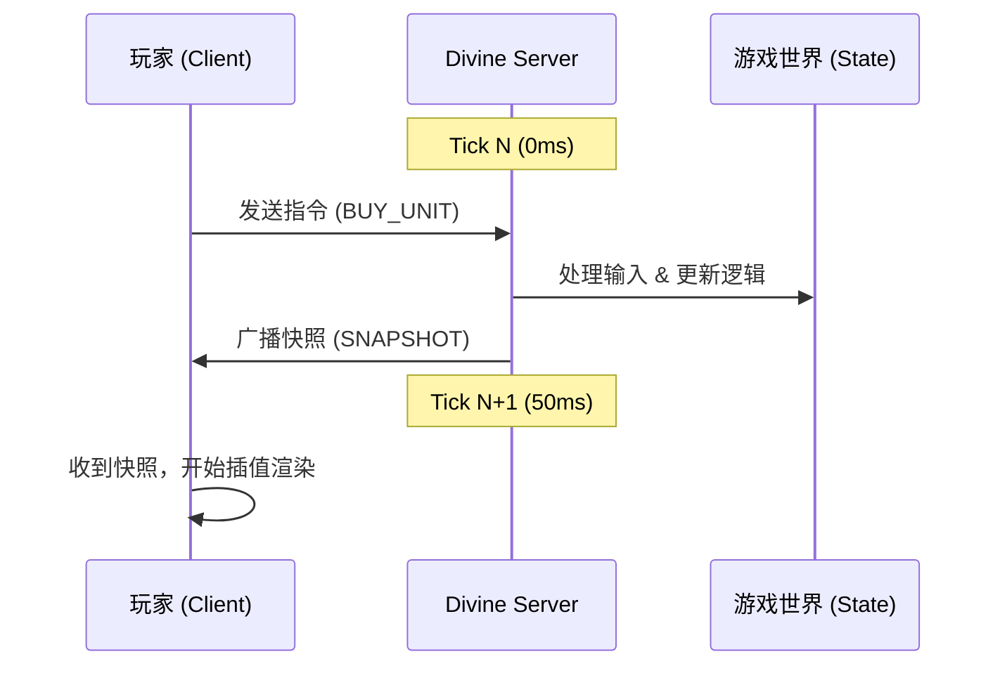

# 恩人协议 (Benefactor Protocol)

> **"在像素的洪流中，成为那个被铭记的恩人。"**

《恩人协议》是一款基于浏览器运行的、追求极致流畅体验的像素风塔防自走棋游戏。本项目采用 **权威服务器 (Authoritative Server)** + **弱客户端 (Thin Client)** 的架构，旨在实现类似《星际争霸》或 MOBA 游戏级别的同步精度。

---

## 🛠️ 技术栈 (Tech Stack)

### 服务端 (Divine Server)
- **Runtime**: Node.js
- **Language**: TypeScript
- **Protocol**: WebSocket (ws)
- **Core Loop**: 20 Hz (50ms) 固定时间步长
- **Architecture**: 权威仲裁模式，负责所有逻辑运算（经济、寻路、伤害）。

### 客户端 (Client)
- **Renderer**: PixiJS (v8+)
- **Build Tool**: Vite
- **Language**: TypeScript
- **Style**: Pixel Art (64x64 Grid)
- **Resolution**: 2560 x 1280 (逻辑分辨率)，全屏自适应

---

## 🏗️ 系统架构 (Architecture)

### 1. 空间与网格 (The Grid)
游戏世界被严格划分在一个 `40 x 20` 的网格系统中。
- **单个格子**: `64 x 64` 像素。
- **总尺寸**: `2560 x 1280` 像素。
- **坐标系**: 服务端只认网格坐标 `(gridX, gridY)`，客户端负责将其转换为屏幕像素 `(pixelX, pixelY)` 并进行插值渲染。

### 2. 权威同步循环 (Sync Loop)


### 3. 文件结构 (Project Structure)
```
wGame/
├── client/                 # 前端项目
│   ├── src/
│   │   ├── containers/     # 视觉容器 (World, HUD)
│   │   ├── managers/       # 管理器 (Network, Resolution, Asset)
│   │   ├── main.ts         # 入口文件
│   └── package.json
├── server/                 # 后端项目
│   ├── src/
│   │   ├── core/           # 核心 (GameServer, GameState, Input)
│   │   ├── systems/        # 子系统 (Battle, Economy, Synergy)
│   │   ├── entities/       # 实体定义
│   │   ├── index.ts        # 入口文件
│   └── package.json
```

---

## 🚀 快速开始 (Quick Start)

### 1. 启动服务端
```bash
cd server
npm install
npm run dev
# 服务端将在端口 3000 上监听...
```

### 2. 启动客户端
```bash
cd client
npm install
npm run dev
# 访问 http://localhost:5173
```

---

## 📘 开发者指南 (Developer Guide)

### 如何新增一种单位？
1. **服务端**: 在 `server/src/core/GameState.ts` 或相关配置表中定义单位属性（血量、攻击力）。
2. **客户端**: 在 `client/src/containers/WorldContainer.ts` 的 `createEntitySprite` 方法中，添加该单位的渲染逻辑（颜色、纹理）。

### 如何修改分辨率？
修改 `client/src/managers/ResolutionManager.ts` 中的 `TARGET_WIDTH` 和 `TARGET_HEIGHT` 常量。注意保持 `40:20` 的比例以配合服务端网格。

### 如何调整游戏节奏？
修改 `server/src/core/GameServer.ts` 中的 `TICK_RATE` 常量。默认 20Hz。提高频率会增加服务器负载但提升物理精度。

---

## 📝 待办事项 (TODO)
- [ ] 实现 A* 寻路算法，让单位能绕过障碍物。
- [ ] 丰富 `BattleSystem`，加入射程判定和弹道计算。
- [ ] 完成 `ShopSystem`，实现随机抽卡逻辑。

---

*Benefactor Protocol - Built with ❤️ for Pixel Art Lovers.*
